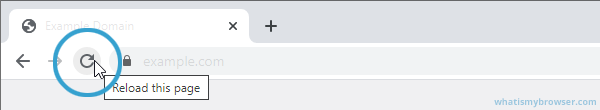

# How to deal with not seeing an update to the website

Sometimes changes on Dragon Maps aren’t immediately visible. This tutorial shows you how to refresh and ensure you see the latest updates.

Web browsers "cache" websites and its content to make loading the website faster. Ultimately, this is efficient and great for all website, including Dragon Maps. One of the biggest downsides to this, especially for a static website, such as Dragon Maps, is that it can be updated and you still wouldn't have the newest update.

If that didn't make sense, don't worry about it, just follow the simple steps below.

You can do a hard refresh whilst viewing Dragon Maps to tell the web browser to reload the entire website, including all the cache.

## Google Chrome (Windows and Linux)
- Hold down the `ctrl` key and press the refresh button or you can press `F5` at the top your keyboard instead of the refresh button (certain keyboards require `FN` key to be held too in addition to the `F5` key).

- Alternatively you can press `ctrl` + `shift` + `R`.

 

## Google Chrome (Mac)
- Hold down the `shift` key and press the refresh button.

- Alternatively press `shift` + `Command` + `R`

 

## Mozilla Firefox (Windows & Linux)
- Hold down the `ctrl` key and press the refresh button or you can press `F5` at the top your keyboard instead of the refresh button (certain keyboards require `FN` key to be held too in addition to the `F5` key).

- Alternatively you can press `ctrl` + `shift` + `R`.

 

## Mozilla Firefox (Mac)
- Hold down the `shift` key and press the refresh button.

- Alternatively press `shift` + `Command` + `R`

 

## Microsoft Edge (Windows & Linux)
- Hold down the `ctrl` key and press the refresh button or you can press `F5` at the top your keyboard instead of the refresh button (certain keyboards require `FN` key to be held too in addition to the `F5` key).

- Alternatively you can press `ctrl` + `shift` + `R`.

 

## Safari (Mac)
- Hold down the `shift` key and press the refresh button.

- Alternatively press `shift` + `Command` + `R`

 

## Opera (Windows & Linux)
- Hold down the `ctrl` key and press the refresh button or you can press `F5` at the top your keyboard instead of the refresh button (certain keyboards require `FN` key to be held too in addition to the `F5` key).

- Alternatively you can press `ctrl` + `shift` + `R`.