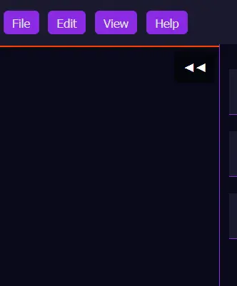

### exporting the map

In this tutorial, we will learn how to export the map to an image. Currently, the export feature is tricky to use, but we are working on improving it.

So the canvas is unlimited as you can tell. You can continuously pan around on the map and you'll never reach the end. This is because the map is generated on the fly and is not a static.

1) To export the map, you need to zoom out as much as possible. To ensure the exported image contains everything you will want to zoom out as much as you can to fit everything in your view of the map.
2) Once everything that you want to export is in view, open up the right panel by clicking the `<<` button.

3) Open up the `Export` tab. Here you will see an image of Dragon Maps logo and an option to export as an image or json.
4) Currently, exporting as Json doesn't do anything. THis is a future feature that will allow you to re-import your map into Dragon Maps.
   In order to be able to use the export button, you will first need to place the Dragon Maps logo onto your map. Drag and drop this image onto your map, then use the circles at the corners of that image to size it to the right size (there is a limit on this so you can't make it too small). You can also move this around on your map, so you can place and size it wherever without obstructing any important details of your map.
5) Once you have the logo on your map, you can click the export button. This will generate an image of your map and download it to your computer.

## Why do I have to have Dragon Maps logo on my map?
This is because, as mentioned in the <a href="../pages/attribution.html">attribution</a> page, we require you to attribute Dragon Maps whenever you use our maps. Please do not try to crop the logo out, future implimentations will comabt this potential issue. If you are using it for a virtual table top, it's possible you can just use a fog of war to cover that part up, so nobody whos playing will need to see where the map came from.